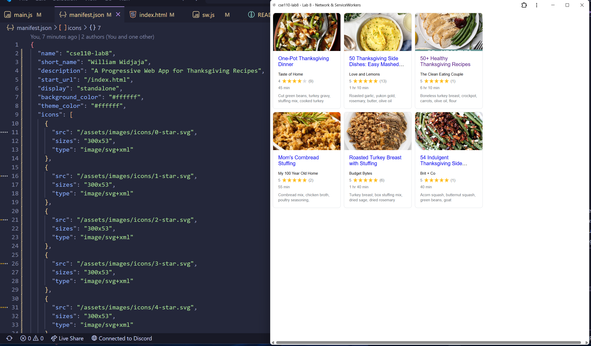

# Lab8-Starter

[Deployed Github Pages Link](https://wwidjaja0.github.io/cse110-lab8/)

How are graceful degradation and service workers related?

Graceful degradation and service workers are related in that both aim to enhance the user experience in web applications, especially under conditions where network connectivity is unreliable or when certain features may not be available. Graceful degradation refers to the design principle where a web application is built to function adequately even when some features fail or are not supported by the user's browser. This means that the core functionality remains accessible, allowing users to still interact with the application, albeit with reduced capabilities. Service workers, on the other hand, are scripts that run in the background of a web application, enabling features like offline access, caching, and background synchronization. They allow developers to implement graceful degradation by providing a fallback mechanism when the network is unavailable or when certain resources cannot be loaded. By using service workers, developers can cache essential assets and data, ensuring that the application can still operate in a limited capacity even when offline or when network conditions are poor. This aligns with the principle of graceful degradation, as it allows the application to maintain a functional state rather than failing completely.

